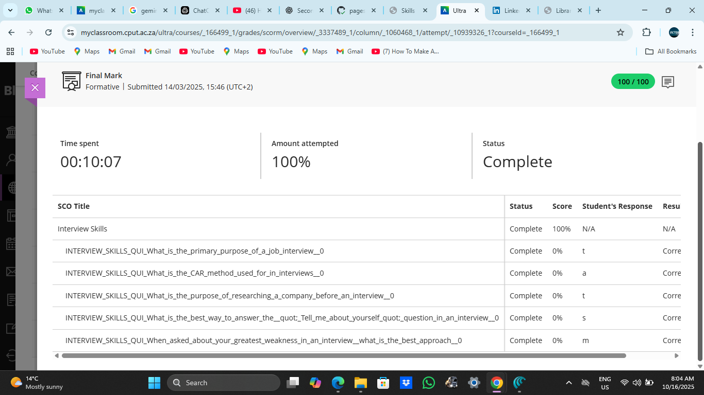

# Interview Skills

## Evidence  
As part of the Work Readiness module, I completed an Interview Skills activity that helped me prepare for real job interviews. This activity focused on learning how to answer common interview questions, present myself professionally, and improve my confidence during interviews.

I practiced structuring my answers using the STAR technique and learned how to highlight my strengths effectively. This exercise helped me understand what employers are looking for and how to communicate my skills clearly.

Here is a screenshot confirming completion of the Interview Skills activity on Blackboard:

---

## Reflection (STAR Technique)

**S – Situation**  
I was required to complete an activity where I practiced responding to common interview questions to demonstrate my readiness for real job interviews.

**T – Task**  
I needed to structure my responses professionally, showcase my strengths, and use the STAR method to answer behavioural questions clearly.

**A – Action**  
I researched typical interview questions, prepared meaningful answers, practiced speaking confidently, and then submitted the completed activity on Blackboard as proof.

**R – Result**  
This activity improved my interview communication skills and boosted my confidence. I now feel more prepared to handle real interviews and present myself professionally to potential employers.
