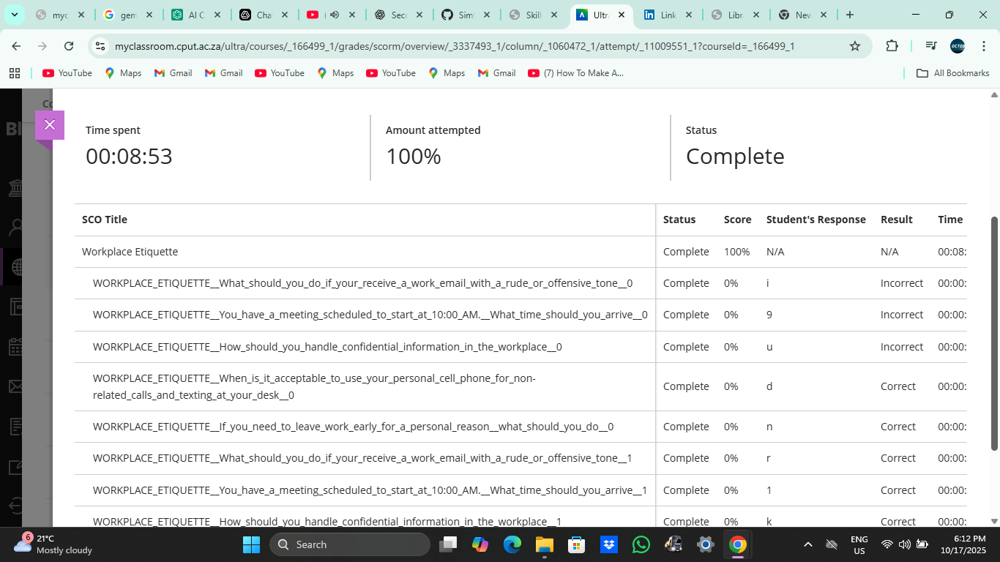

# Workplace Etiquette

## Evidence  
As part of the Work Readiness module, I completed a Workplace Etiquette activity to learn about professional behaviour in a real work environment. This activity focused on topics such as respect, communication, teamwork, punctuality, dress code, and appropriate behaviour in the workplace.

Understanding workplace etiquette is important because it helps build a positive reputation, maintain good relationships with colleagues, and create a professional image. This activity prepared me for what is expected in a real job setting.

Here is a screenshot confirming that I completed the Workplace Etiquette activity on Blackboard:

---

## Reflection (STAR Technique)

**S – Situation**  
I was required to complete a Workplace Etiquette task to understand the expected behaviour and professionalism required in the workplace.

**T – Task**  
My goal was to learn how to act professionally, communicate respectfully, and follow proper etiquette in different workplace situations.

**A – Action**  
I studied examples of professional behaviour, participated in the activity, and reflected on how etiquette affects teamwork and communication. I then submitted my completed task on Blackboard.

**R – Result**  
I gained a better understanding of professional standards in the workplace. I now feel more confident about how to behave, communicate, and collaborate effectively in a professional environment.
